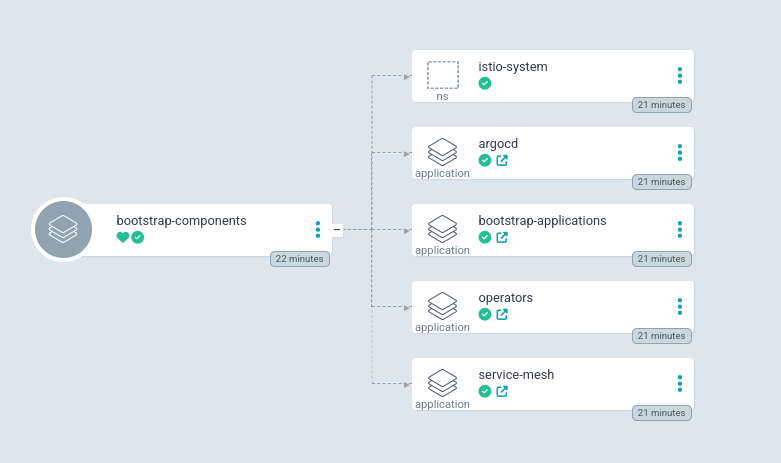

This folder contains all the resources necessary to start up the cluster components. 

# Install ArgoCD operator

ArgoCD orchestrates the components and applications installation. If we don't have it in our cluster, we have to install it using the ```OpenShift GitOps Operator```

```bash
oc apply -f ../../components/openshift/operators/openshift-gitops.yaml
```

# Grant roles to ArgoCD

We will install some namespaces and operators, so we need grant cluster admin roles to ArgoCD controller

```bash
oc apply -f admin-clusterrolebinding.yaml
```

# Bootstrap Application

Now, we can apply the Bootstrap ArgoCD application. This application will create 

```bash
oc apply -f bootstrap-components.yaml
```

This application creates the following applications with his resources:



# Check the installation

We have to ask for the password and the URL:

```bash
oc get route -n openshift-gitops openshift-gitops-server --no-headers | awk '{print $2}'
```

```bash
oc -n openshift-gitops get secret openshift-gitops-cluster -o json | jq -r '.data["admin.password"]' | base64 -d
```